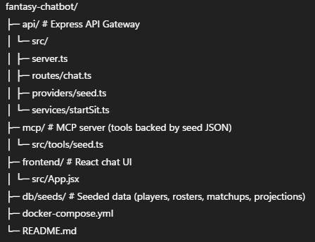

# 🏈 GridironGPT – Fantasy Football Chatbot (MVP)

### An AI-inspired fantasy football assistant that helps analyze your roster and suggest **start/sit decisions**.  
### This MVP version runs fully locally with **seeded data**, so you can demo the workflow without needing live API keys.

---

## Project Status
**Development currently in progress**

---

## 🚀 Tech Stack
- **Frontend**: React + TailwindCSS (Vite)  
- **Backend API**: Node.js + Express (TypeScript)  
- **MCP Server**: Tool layer exposing roster/matchup functions  
- **Database**: DynamoDB Local (with JSON seeds)  
- **Containerization**: Docker Compose

---

## 📂 Project Structure


---

## ⚡ Features (MVP)
- Chat UI with simple conversation history.  
- Paste a **League ID** (stubbed in MVP).  
- API endpoint `/api/chat` that:  
  - Reads from seed JSON (`db/seeds/`)  
  - Applies a **start/sit heuristic v0** (higher projected points wins)  
  - Returns a recommendation + short reasoning.  
- MCP server stub exposing roster/matchup/projection tools.

---

## 🛠️ Getting Started

### 1. Clone the repo
```bash
git clone https://github.com/<your-username>/fantasy-chatbot.git
cd fantasy-chatbot
```

---

## Setup Environment
```bash
cp .env.example .env
```

## Run with Docker
```bash
docker compose up --build
```

